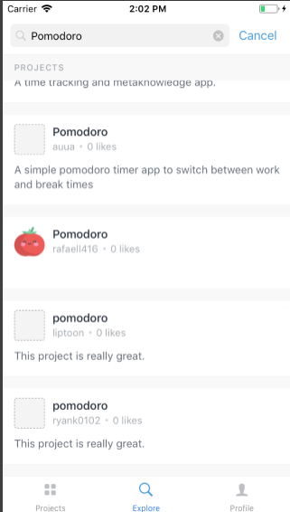

# Pomodoro App

This is a nice app to get in practice the pomodoro technique which is a lot of useful for increase your productivity by creating small cycles of work and breaks. You can get more info here: [The pomodoro technique](https://en.wikipedia.org/wiki/Pomodoro_Technique)

## Test the App

### Android
The app is deployed in [Expo](https://expo.io), so make sure you have installed the expo client app
you can do it [here](https://play.google.com/store/apps/details?id=host.exp.exponent&hl=en)

Then you just have to open the next link on your browser and user the expo client app to scan the QR code to run the app in your phone.
=> [pomodoro](https://exp.host/@rafaell416/pomodoro)

### Ios
If you're using an Iphone, the same as android for you, make sure you have installed the expo client app, you can do it [here](https://itunes.apple.com/us/app/expo-client/id982107779?mt=8)

Then you just have to open the app and go to explore tab, there just search for Pomodoro and click on the app to open it.



## For Devs

### Local Installation

Running the app locally is pretty simple, just follow up these commands
```
git clone git@github.com:Rafaell416/pomodoro-rn-app.git

cd pomodoro-rn-app

yarn install

yarn start
```
### Stack

This app was made with the next Stack of Technologies

- [React Native](https://facebook.github.io/react-native/)
- [Apollo Graphql](https://www.apollographql.com/)
- [Expo](https://expo.io)
